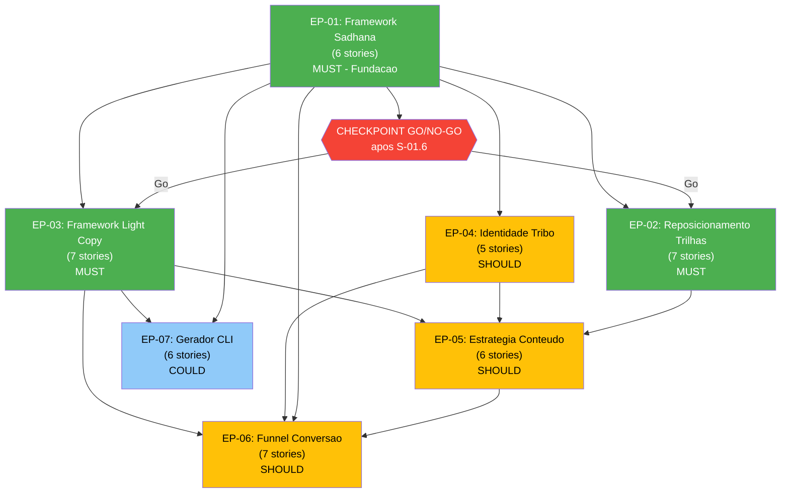
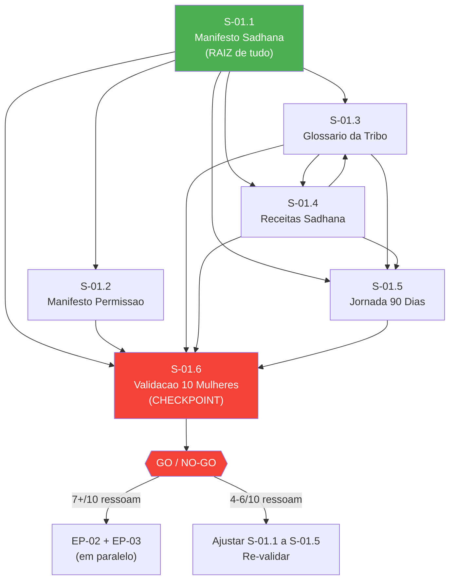
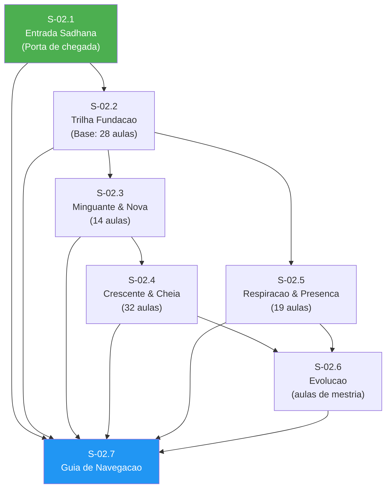
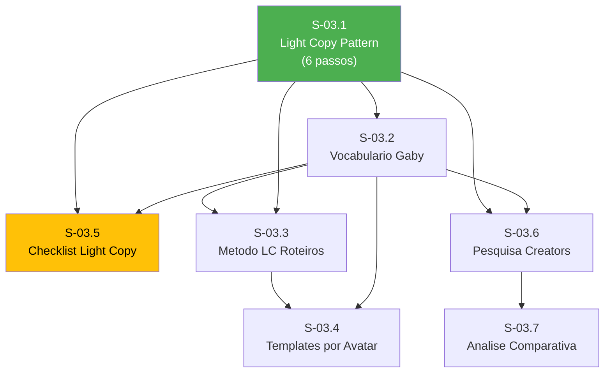
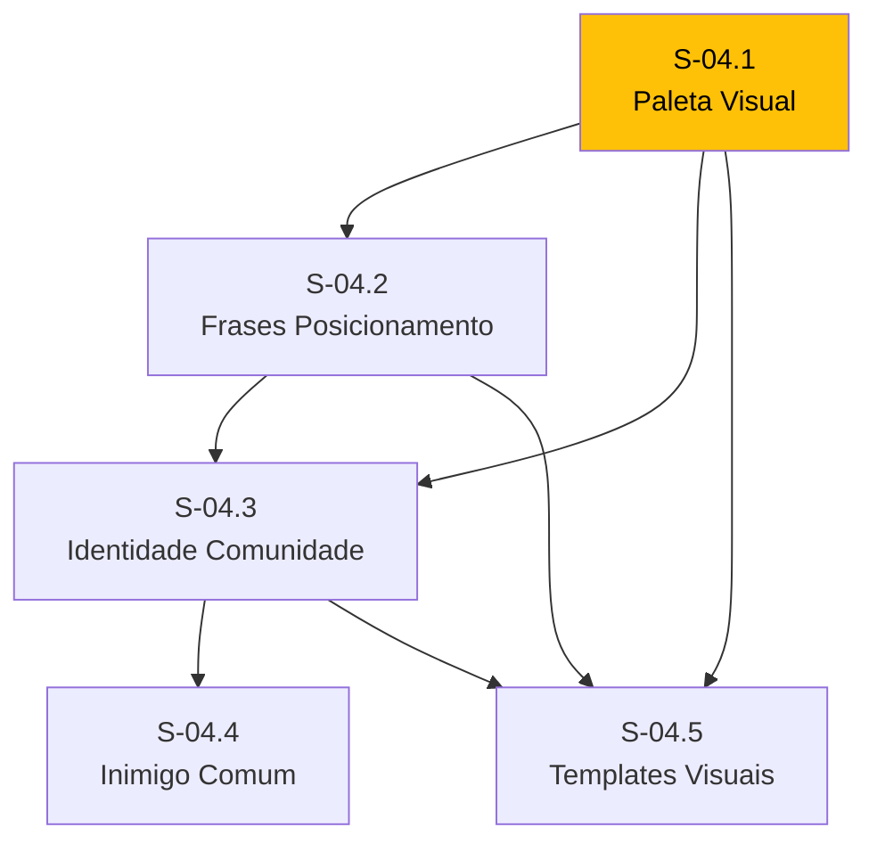
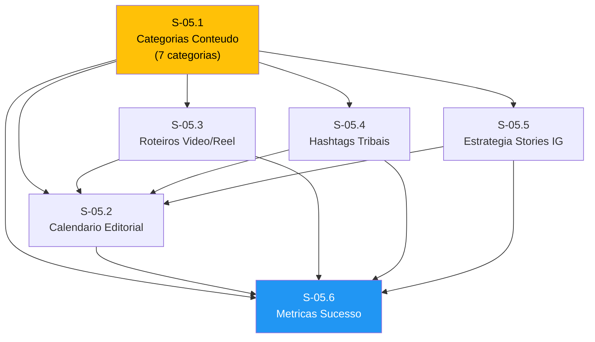
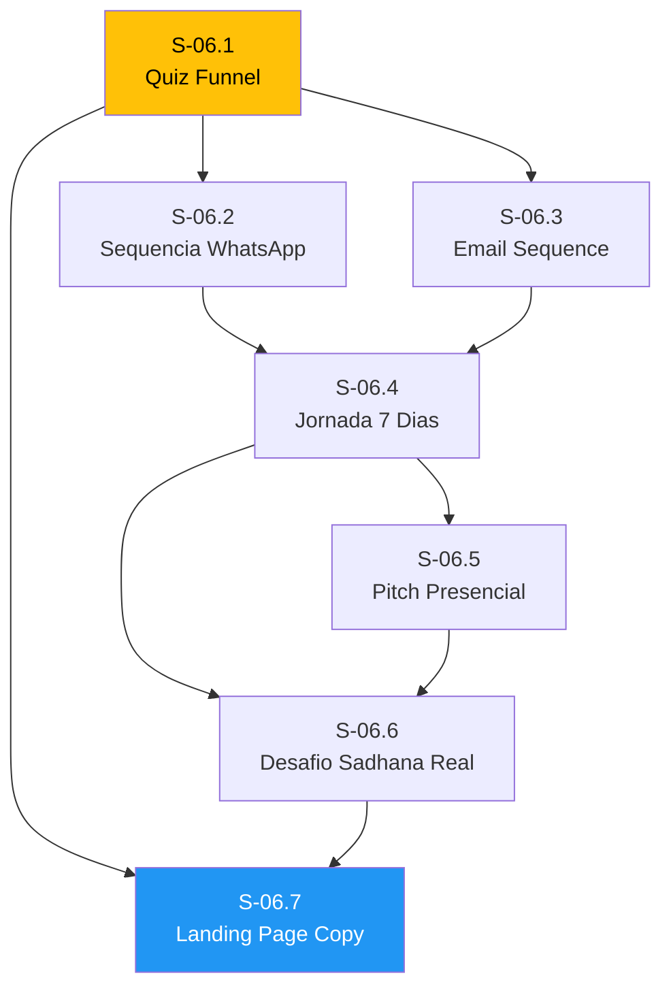
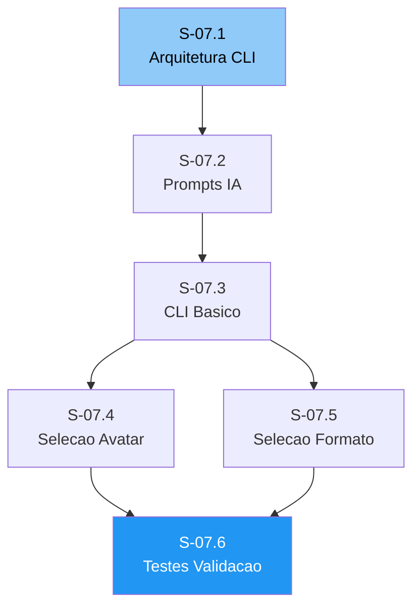

# Mapa Visual de Fluxo das Stories — Mente Leve Sadhana

**Data:** 14/02/2026
**Total:** 50 stories em 8 Epics

---

## VISAO GERAL — Fluxo entre Epics



---

## FLUXO DETALHADO — EP-01: Framework Sadhana (Fundacao)



---

## FLUXO DETALHADO — EP-02: Reposicionamento de Trilhas



---

## FLUXO DETALHADO — EP-03: Framework Light Copy



---

## FLUXO DETALHADO — EP-04: Identidade de Tribo



---

## FLUXO DETALHADO — EP-05: Estrategia de Conteudo



---

## FLUXO DETALHADO — EP-06: Funnel de Conversao



---

## FLUXO DETALHADO — EP-07: Gerador CLI



---

## LINHA DO TEMPO — Fases de Execucao

```
FASE 1: FUNDACAO (Semanas 1-3)
═══════════════════════════════════════════════
  EP-01: S-01.1 → S-01.2 → S-01.3 ←→ S-01.4 → S-01.5 → S-01.6
                                                            ↓
                                                    [CHECKPOINT GO/NO-GO]
                                                            ↓
FASE 2: FRAMEWORKS (Semanas 4-6) ← EP-02 e EP-03 em paralelo
═══════════════════════════════════════════════
  EP-02: S-02.1 → S-02.2 → S-02.3 → S-02.4
                         → S-02.5 → S-02.6 → S-02.7
  EP-03: S-03.1 → S-03.2 → S-03.3 → S-03.4
                         → S-03.5
                         → S-03.6 → S-03.7

FASE 3: IDENTIDADE + CONTEUDO (Semanas 7-9) ← EP-04 e EP-05 em paralelo
═══════════════════════════════════════════════
  EP-04: S-04.1 → S-04.2 → S-04.3 → S-04.4
                                   → S-04.5
  EP-05: S-05.1 → S-05.2
                → S-05.3 → S-05.6
                → S-05.4
                → S-05.5

FASE 4: CONVERSAO + CLI (Semanas 10-12) ← EP-06 e EP-07 em paralelo
═══════════════════════════════════════════════
  EP-06: S-06.1 → S-06.2 → S-06.4 → S-06.5 → S-06.6 → S-06.7
                → S-06.3 ↗
  EP-07: S-07.1 → S-07.2 → S-07.3 → S-07.4 → S-07.6
                                   → S-07.5 ↗
```

---

## LEGENDA

| Cor | Significado |
|-----|-------------|
| Verde | MUST (prioridade maxima) |
| Amarelo | SHOULD (importante) |
| Azul claro | COULD (desejavel) |
| Vermelho | Checkpoint de decisao |
| Azul escuro | Story de consolidacao/entrega final do Epic |

---

## PONTOS DE CONVERGENCIA (Stories que combinam multiplas fontes)

| Story | Recebe de | Por que importa |
|-------|-----------|----------------|
| **S-01.6** (Validacao) | S-01.1 a S-01.5 | Decide se segue ou ajusta |
| **S-02.7** (Guia Navegacao) | S-02.1 a S-02.6 | Consolida todas as trilhas |
| **S-05.1** (Categorias) | EP-01 + EP-03 + EP-04 | Une framework + copy + identidade |
| **S-06.7** (Landing Page) | EP-02 + EP-03 + EP-04 + EP-06 | Peca final do funil |
| **S-07.6** (Testes CLI) | S-07.1 a S-07.5 | Valida o gerador completo |

---

## Change Log

| Data | Descricao | Autor |
|------|-----------|-------|
| 14/02/2026 | Criacao do mapa visual | Pax (PO) |

---

## ATUALIZAÇÃO 18/02/2026 - EP-08: Oráculo do Sadhana (MVP Stateless)

`mermaid
graph TD
    S81["S-08.1\nConceito + Guardrails"] --> S82["S-08.2\nModelagem + 33 Cartas"]
    S82 --> S83["S-08.3\nFluxo Tirar Carta"]
    S83 --> S84["S-08.4\nExperiência Stateless"]
    S84 --> S86["S-08.6\nMétricas + Piloto Beta"]
    S84 --> S85["S-08.5\nPlano Fase 2\n(Persistência + Admin)"]

    style S81 fill:#4CAF50,color:#fff
    style S82 fill:#4CAF50,color:#fff
    style S83 fill:#4CAF50,color:#fff
    style S84 fill:#4CAF50,color:#fff
    style S86 fill:#2196F3,color:#fff
    style S85 fill:#90CAF9,color:#000
`

### Observação de escopo
- No MVP, não há salvamento de dados de usuário.
- Persistência e histórico ficam planejados para fase 2.
