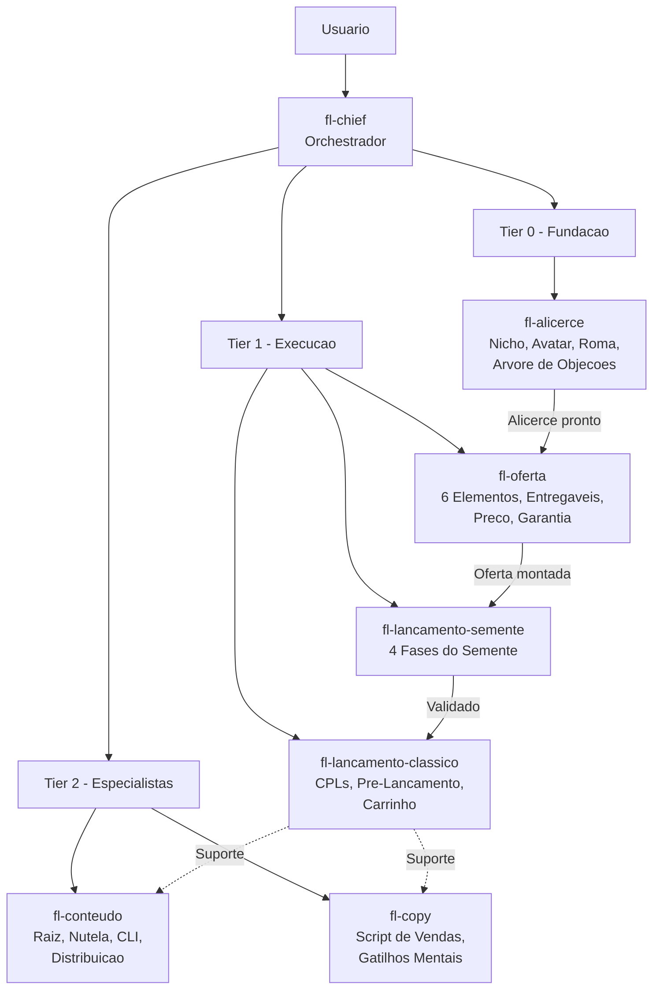

# Formula de Lancamento

Squad baseado 100% nas transcricoes do curso Formula de Lancamento (Erico Rocha / Hugo Rocha - Ignicao Digital). Toda sugestao e rastreavel a uma aula especifica do curso. Nunca inventa fora do escopo das aulas.

**Version:** 1.0.0
**Domain:** digital-product-launches
**Language:** pt-BR
**Orchestrator:** fl-chief

---

## Quick Start

```bash
# Ativar o squad (direciona para o orquestrador)
@formula-lancamento:fl-chief

# Ou ativar um agente especifico
@formula-lancamento:fl-alicerce           # Nicho, Avatar, Roma
@formula-lancamento:fl-oferta             # Montar oferta irresistivel
@formula-lancamento:fl-lancamento-semente # Primeiro lancamento
@formula-lancamento:fl-lancamento-classico # Escalar com CPLs
@formula-lancamento:fl-conteudo           # Conteudo Raiz e Nutela
@formula-lancamento:fl-copy              # Scripts e gatilhos mentais
```

---

## Arquitetura do Squad



---

## Agentes

| ID | Role | Tier | Ativacao |
|----|------|------|----------|
| **fl-chief** | Orchestrador — identifica o marco do usuario e direciona pro agente certo | orchestrator | `@formula-lancamento:fl-chief` |
| **fl-alicerce** | Especialista em Alicerce — Nicho, Avatar, Roma, Arvore de Objecoes | 0 | `@formula-lancamento:fl-alicerce` |
| **fl-oferta** | Especialista em Oferta — 6 elementos, Entregaveis, Preco, Garantia | 1 | `@formula-lancamento:fl-oferta` |
| **fl-lancamento-semente** | Especialista em Lancamento Semente — 4 fases completas | 1 | `@formula-lancamento:fl-lancamento-semente` |
| **fl-lancamento-classico** | Especialista em Lancamento Classico — CPLs, Pre-Lancamento, Carrinho | 1 | `@formula-lancamento:fl-lancamento-classico` |
| **fl-conteudo** | Especialista em Conteudo — Raiz, Nutela, CLI, Distribuicao | 2 | `@formula-lancamento:fl-conteudo` |
| **fl-copy** | Especialista em Copy — Script de Vendas, Gatilhos Mentais, Objecoes | 2 | `@formula-lancamento:fl-copy` |

---

## Cobertura de Modulos

Todos os 8 modulos do curso foram extraidos com Framework + SOP + Checklist:

| Modulo | Framework | SOP | Checklist |
|--------|-----------|-----|-----------|
| Base e Fundamentos | `base-fundamentos-framework.md` | `base-fundamentos-sop.md` | `base-fundamentos-checklist.md` |
| Lancamento Semente | `lancamento-semente-framework.md` | `lancamento-semente-sop.md` | `lancamento-semente-checklist.md` |
| Lancamento Classico | `lancamento-classico-framework.md` | `lancamento-classico-sop.md` | `lancamento-classico-checklist.md` |
| Lancamento Caixa | `lancamento-caixa-framework.md` | `lancamento-caixa-sop.md` | `lancamento-caixa-checklist.md` |
| Trafego Pago | `trafego-pago-framework.md` | `trafego-pago-sop.md` | `trafego-pago-checklist.md` |
| Como Criar um Produto 6em7 | `produto-6em7-framework.md` | `produto-6em7-sop.md` | `produto-6em7-checklist.md` |
| Material Complementar | `material-complementar-framework.md` | `material-complementar-sop.md` | `material-complementar-checklist.md` |
| Tudo para Ser um Lancador | `lancador-expert-framework.md` | `lancador-expert-sop.md` | `lancador-expert-checklist.md` |

**Localizacao dos arquivos:**
- Frameworks: `docs/frameworks/`
- SOPs: `docs/sops/`
- Checklists: `checklists/`

---

## Workflows

| Workflow | Descricao | Agentes Envolvidos |
|----------|-----------|-------------------|
| **wf-lancamento-semente** | Fluxo completo do primeiro lancamento (validacao ate abertura de carrinho) | fl-chief > fl-alicerce > fl-oferta > fl-lancamento-semente |
| **wf-lancamento-classico** | Fluxo do lancamento escalado com CPLs e sequencia de pre-lancamento | fl-chief > fl-lancamento-classico > fl-conteudo > fl-copy |

### wf-lancamento-semente

```
1. fl-chief diagnostica o marco atual
2. fl-alicerce constroi/valida Nicho + Avatar + Roma
3. fl-oferta monta a oferta com os 6 elementos
4. fl-lancamento-semente executa as 4 fases:
   - Fase 1: Lista e Relacionamento
   - Fase 2: Pre-Lancamento (pesquisa + conteudo)
   - Fase 3: Lancamento (aula ao vivo + oferta)
   - Fase 4: Pos-Lancamento (entrega + depoimentos)
```

### wf-lancamento-classico

```
1. fl-chief valida pre-requisitos (semente feito, lista construida)
2. fl-lancamento-classico planeja a sequencia de CPLs
3. fl-conteudo cria conteudo de pre-lancamento (Raiz + Nutela)
4. fl-copy escreve scripts dos CPLs e emails de carrinho
5. fl-lancamento-classico executa:
   - Pre-Pre-Lancamento
   - CPL1: Oportunidade
   - CPL2: Transformacao
   - CPL3: Experiencia de Dono
   - Abertura e Fechamento de Carrinho
```

---

## Tasks

| Task | Descricao | Agente Padrao |
|------|-----------|---------------|
| **diagnosticar-marco** | Identifica em qual marco da jornada o usuario esta e recomenda proximo passo | fl-chief |
| **construir-alicerce** | Guia completo para definir Nicho, Avatar, Roma e Arvore de Objecoes | fl-alicerce |
| **montar-oferta** | Constroi oferta irresistivel com os 6 elementos da FL | fl-oferta |
| **planejar-conteudo** | Planeja estrategia de conteudo Raiz e Nutela para pre-lancamento | fl-conteudo |
| **escrever-cpl** | Escreve script completo de CPL (1, 2 ou 3) com gatilhos mentais | fl-copy |

---

## Templates

| Template | Descricao | Usado Por |
|----------|-----------|-----------|
| **template-script-vendas** | Estrutura completa de script de vendas com gatilhos mentais e quebra de objecoes | fl-copy |
| **template-oferta** | Canvas dos 6 elementos da oferta (Entregaveis, Bonus, Garantia, Preco, Escassez, Urgencia) | fl-oferta |
| **template-email-carrinho** | Sequencia de emails para abertura e fechamento de carrinho (D1 a D7) | fl-copy, fl-lancamento-classico |

---

## Regras de Qualidade

1. **Zero invencao** — Todo conselho deve ser rastreavel a uma aula especifica do curso. Formato de citacao: `[SOURCE: Modulo > Aula]`.
2. **Rastreabilidade de fonte** — Nunca inventar estrategias fora do que o curso ensina. Se nao souber responder com base nas aulas, dizer explicitamente.
3. **Respeito a jornada** — Alertar quando o usuario quiser pular marcos da jornada (ex: querer fazer lancamento classico sem ter feito o semente).
4. **Contexto de fase** — Sempre mencionar em qual fase/marco da jornada a sugestao se aplica.
5. **Confissao de ignorancia** — Se a pergunta extrapola o escopo das transcricoes, o agente deve declarar: "Isso esta fora do escopo das aulas da Formula de Lancamento. Recomendo buscar essa informacao em outra fonte."

---

## Jornada do Lancador

A jornada completa conforme ensinada no curso, do zero ao lancamento escalado:

```
ALICERCE ──> OFERTA ──> SEMENTE ──> CLASSICO ──> ESCALA
   |            |           |            |            |
   v            v           v            v            v
 Nicho       6 Elem.    4 Fases      CPLs       Lancamento
 Avatar      Preco      Lista        Pre-Lanc.  Caixa
 Roma        Garantia   Ao Vivo      Carrinho   Trafego Pago
 Objecoes    Bonus      Depoim.     Emails      Produto 6em7
```

### Marco 1: Alicerce (Tier 0)

Definir o fundamento antes de qualquer lancamento:
- **Nicho**: Escolher mercado com demanda, paixao e expertise
- **Avatar**: Mapear dores, desejos, medos e objecoes do cliente ideal
- **Roma**: Definir a Roma (destino) que o produto leva o avatar a alcancar
- **Arvore de Objecoes**: Catalogar e preparar respostas para cada objecao

### Marco 2: Oferta (Tier 1)

Montar uma oferta que o avatar nao consegue recusar:
- **6 Elementos**: Entregaveis, Bonus, Garantia, Preco, Escassez, Urgencia
- **Entregaveis**: O que exatamente o cliente recebe
- **Preco**: Ancoragem e justificativa de valor
- **Garantia**: Remover risco da decisao de compra

### Marco 3: Lancamento Semente (Tier 1)

Primeiro lancamento com lista pequena para validar:
- **Fase 1**: Construir lista e relacionamento
- **Fase 2**: Pre-lancamento com pesquisa e conteudo de valor
- **Fase 3**: Lancamento ao vivo com oferta
- **Fase 4**: Pos-lancamento com entrega e coleta de depoimentos

### Marco 4: Lancamento Classico (Tier 1)

Escalar com sequencia de CPLs gravados:
- **CPL1**: Oportunidade — mostrar que existe um caminho
- **CPL2**: Transformacao — provar que funciona
- **CPL3**: Experiencia de Dono — fazer o avatar se ver no resultado
- **Carrinho**: Sequencia de abertura e fechamento com urgencia real

### Marco 5: Escala

Dominar trafego pago, criar produto premium (6em7) e repetir lancamentos com consistencia.

---

## Estrutura de Arquivos

```
squads/formula-lancamento/
├── agents/
│   ├── fl-chief.md               # Orchestrador
│   ├── fl-alicerce.md            # Alicerce (Tier 0)
│   ├── fl-oferta.md              # Oferta (Tier 1)
│   ├── fl-lancamento-semente.md  # Lancamento Semente (Tier 1)
│   ├── fl-lancamento-classico.md # Lancamento Classico (Tier 1)
│   ├── fl-conteudo.md            # Conteudo (Tier 2)
│   └── fl-copy.md                # Copy (Tier 2)
├── checklists/
│   ├── base-fundamentos-checklist.md
│   ├── lancamento-semente-checklist.md
│   ├── lancamento-classico-checklist.md
│   ├── lancamento-caixa-checklist.md
│   ├── trafego-pago-checklist.md
│   ├── produto-6em7-checklist.md
│   ├── material-complementar-checklist.md
│   └── lancador-expert-checklist.md
├── docs/
│   ├── frameworks/               # 8 frameworks (1 por modulo)
│   └── sops/                     # 8 SOPs (1 por modulo)
├── tasks/                        # Tasks executaveis
├── config.yaml
└── README.md
```

---

**Mantido por:** AIOS Team
**Ultima atualizacao:** 2026-03-08
**Fonte:** Transcricoes do curso Formula de Lancamento (Ignicao Digital)
